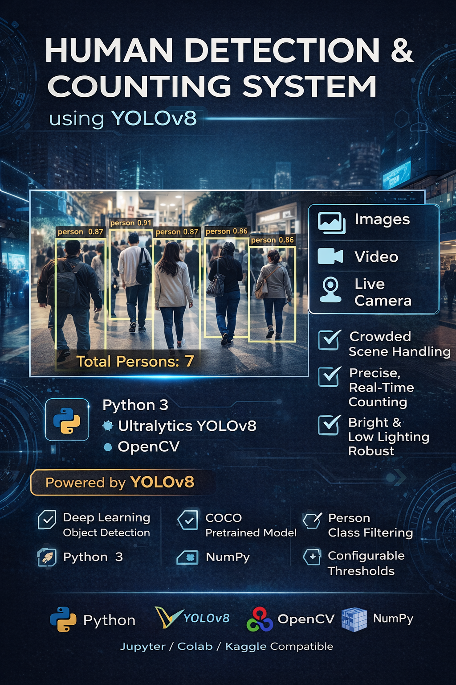

# 🧍‍♂️ Human Detection & Counting System using YOLOv8

## 📌 Project Overview

This project implements a **robust human detection and counting system** using a modern deep-learning approach powered by **YOLOv8**.
The system accurately detects and counts people in **images, videos, and live camera streams**, even in challenging scenarios such as:

* Crowded scenes
* Overlapping individuals
* Partial body visibility
* Different lighting conditions and poses

Unlike traditional computer-vision approaches, this solution leverages a **state-of-the-art object detection model** to deliver high accuracy and reliability across real-world use cases.

---

## 🎯 Motivation

Early experiments using classical methods such as **HOG + SVM (OpenCV People Detector)** showed significant limitations:

* Poor performance in crowded or close-range scenes
* Frequent under-counting of people
* Sensitivity to pose and image scale

To overcome these limitations, the project was redesigned using **YOLOv8**, a deep-learning model trained on large-scale datasets for object detection, achieving **far superior accuracy and consistency**.

---

## 🚀 Key Features

* ✅ Accurate **person detection and counting**
* 🖼️ Supports **images**
* 🎥 Supports **video files**
* 📷 Supports **live camera feeds** (local environments)
* 🔍 Confidence and IoU threshold tuning
* 🧠 Deep-learning-based (YOLOv8)
* 📦 Clean, modular, and notebook-friendly code
* 🧾 Automatic bounding boxes and labels
* 💾 Optional output image/video saving

---

## 🧠 Model Used

* **YOLOv8 (You Only Look Once v8)**
* Pretrained on the **COCO dataset**
* Detects multiple object classes — this project filters **persons only (class ID: 0)**

Available model options:

* `yolov8n.pt` → fastest, lower accuracy
* `yolov8s.pt` → balanced (used in this project)
* `yolov8m.pt / yolov8l.pt` → higher accuracy, slower

---

## 🛠️ Technology Stack

* **Python 3**
* **OpenCV**
* **Ultralytics YOLOv8**
* **NumPy**
* **Jupyter / Google Colab / Kaggle compatible**

